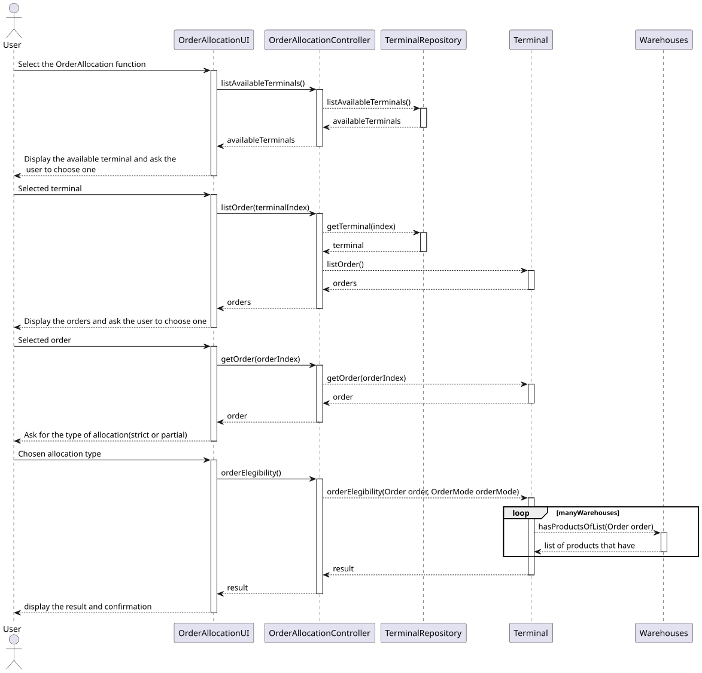
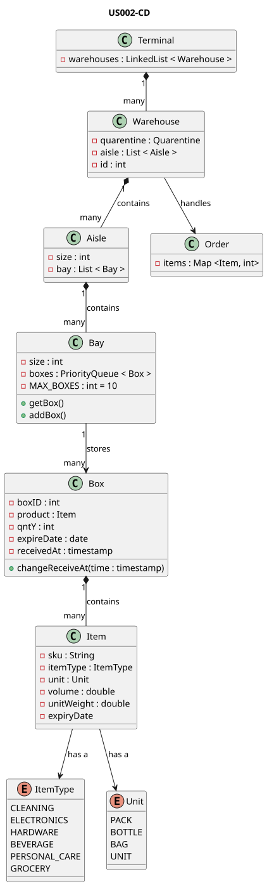

# US002 - As a warehouse planner, when I receive open orders, I want the system to examine current inventory and allocate quantities from boxe

## 3. Design

### 3.1. Description

### 3.2. Rationale

**The rationale grounds on the SSD interactions and the identified input/output data.**

| Interaction ID                                   | Question: Which class is responsible for... | Answer              | Justification (with patterns) |
|:-------------------------------------------------|:--------------------------------------------|:--------------------|:------------------------------|
| Step 1: Receiving all the inputs from user       | receiving all the user's inputs?            | `OrderAllocationUI` | Pure Fabrication              | 
|                                                  | read and save which terminal to use?        | `OrderAllocationUI` | Pure Fabrication              | 
|                                                  | read and save which order to allocate?      | `OrderAllocationUI` | Pure Fabrication              | 
|                                                  | read and save which type of allocation?     | `OrderAllocationUI` | Pure Fabrication              | 
| Step 2: Simple validation of inputs              | simple validating the inputs?               | `OrderAllocationUI` | Pure Fabrication              |
| Step 3: Get the wanted order                     | getting the wanted order?                   | `Terminal`          |                               |
| Step 4: Go through each warehouse                | going through each warehouse?               | `Terminal`          |                               |
| Step 5: Search for the items in the warehouses   | searching for the items in the warehouses?  | `Warehouse`         |                               |
| Step 6: Take the wanted items from the boxes     | Taking the wanted items from the boxes?     | `Bay`               | Pure Fabrication              |
| Step 7: Create the list of the order eligibility | Creating the list of the order eligibility? | `Terminal`          |                               |

### Systematization ##

According to the taken rationale, the conceptual classes promoted to software classes are:

* Warehouse
* Terminal 
* Aisle
* Order
* Bay 
* Box 

Other software classes (i.e. Pure Fabrication) identified:

* TerminalRepository
* OrderAllocationUI
* OrderAllocationController

## 3.3. Sequence Diagram (SD)

## 3.4. Class Diagram (CD)

