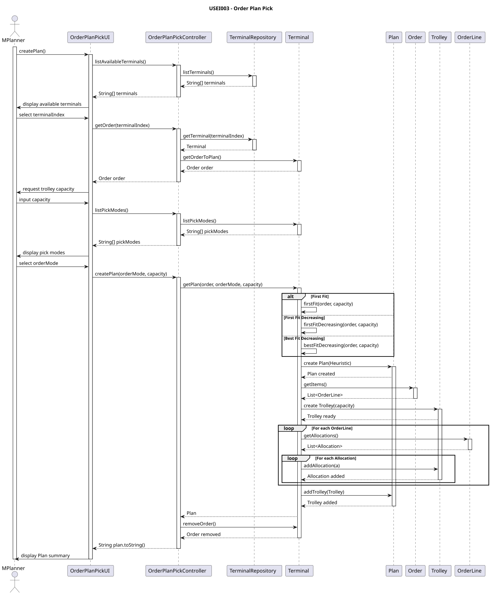
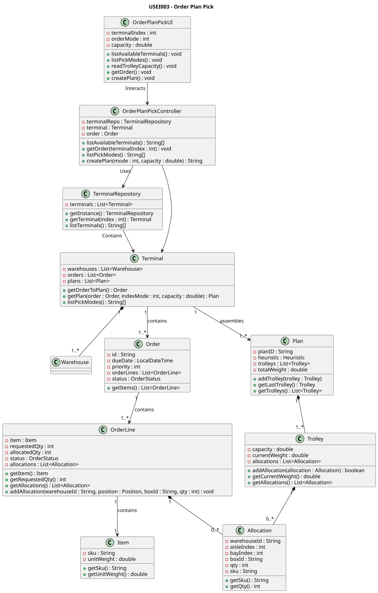

# US003 - As a planner, I want to pack the allocation rows produced by USEI02 into capacity-bounded trolleys, choosing one of the packing heuristics. So pickers can complete runs without overloading trolleys.

## 3. Design

### 3.1. Description

### 3.2. Rationale

**The rationale grounds on the SSD interactions and the identified input/output data.**

| Interaction ID               | Question: Which class is responsible for...                   | Answer               | Justification (with patterns)        |
| :--------------------------- | :------------------------------------------------------------ | :------------------- | :----------------------------------- |
| 1: Initiates process         | instantiating the UI class                                    | `OrderPlanPickUI`    | Pure Fabrication                     |
|                              | obtaining the list of terminals                               | `TerminalRepository` | Information Expert, Pure Fabrication |
|                              | displaying the available terminals                            | `OrderPlanPickUI`    | Pure Fabrication                     |
| 2: Selects terminal          | receiving the user’s terminal selection                       | `OrderPlanPickUI`    | Pure Fabrication                     |
|                              | storing the selected terminal index                           | `OrderPlanPickUI`    | Pure Fabrication                     |
| 3: Displays available orders | obtaining the list of orders for the selected terminal        | `Terminal`           | Information Expert                   |
|                              | displaying the available orders to the user                   | `OrderPlanPickUI`    | Pure Fabrication                     |
| 4: Selects order             | receiving the user’s order selection                          | `OrderPlanPickUI`    | Pure Fabrication                     |
|                              | storing the selected order index                              | `OrderPlanPickUI`    | Pure Fabrication                     |
| 5: Displays picking modes    | retrieving the list of available picking modes                | `Terminal`           | Information Expert                   |
|                              | showing picking mode options to the user                      | `OrderPlanPickUI`    | Pure Fabrication                     |
| 6: Selects picking mode      | receiving the picking mode selection                          | `OrderPlanPickUI`    | Pure Fabrication                     |
|                              | storing the selected picking mode                             | `OrderPlanPickUI`    | Pure Fabrication                     |
| 7: Reads trolley capacity    | requesting the trolley capacity from the user                 | `OrderPlanPickUI`    | Pure Fabrication                     |
|                              | saving the trolley capacity                                   | `OrderPlanPickUI`    | Pure Fabrication                     |
| 8: Gets order eligibility    | retrieving the order eligibility lines                        | `Terminal`           | Information Expert                   |
|                              | providing the list of eligibility lines                       | `Terminal`           | Information Expert                   |
| 9: Creates picking plan      | creating the picking plan based on selected mode and capacity | `Terminal`           | Information Expert                   |
|                              | generating and storing the plan                               | `Plan`               | Information Expert                   |
|                              | computing allocations and trolleys                            | `Terminal`           | Information Expert                   |
| 10: Displays result          | showing the result of the plan creation to the user           | `OrderPlanPickUI`    | Pure Fabrication                     |

### Systematization ##

According to the taken rationale, the conceptual classes promoted to software classes are:

* Terminal
* Plan

Other software classes (i.e. Pure Fabrication) identified:

* TerminalRepository
* OrderPlanPickUI
* OrderPlanPickController

## 3.3. Sequence Diagram (SD)

## 3.4. Class Diagram (CD)

