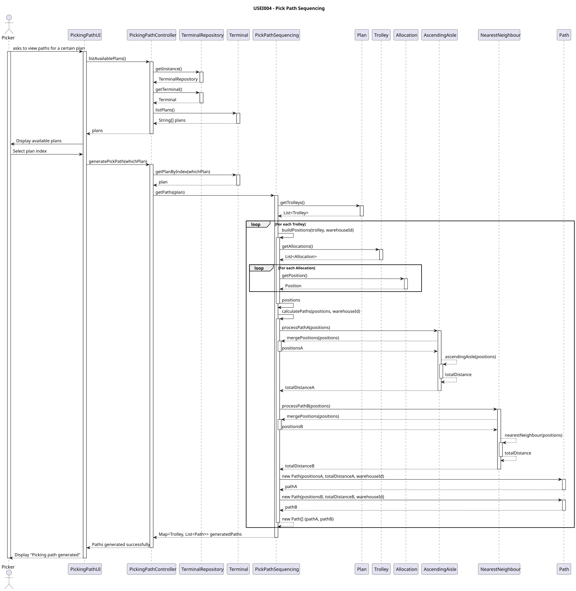
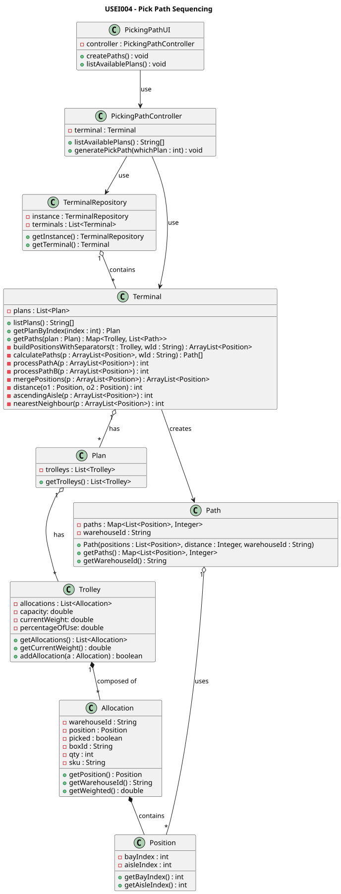

# US004 -  As a picker, I want to plan the task of picking up several boxes.

## 3. Design

### 3.1. Description

- Distance: D = b1 + |a1−a2|∗3 + b2
- Strategy A - Deterministic Sweep - Start by sorting the bays of boxes ascending by aisle.
- Strategy B - Nearest-Neighbour (greedy) - Start by sorting the bays using the distance function D.
- Next, calculate the distance to pick the boxes in that order (using the distance function D).

### 3.2. Rationale

**The rationale grounds on the SSD interactions and the identified input/output data.**

| Interaction ID                                                    | Question: Which class is responsible for...       | Answer                   | Justification (with patterns) |
|:------------------------------------------------------------------|:--------------------------------------------------|:-------------------------|:------------------------------|
| Step 1: Receiving the plan input from user to calculate the paths | receiving all the user's inputs?                  | `PickingPathUI`          | Pure Fabrication              | 
|                                                                   | retrieving the list of available plans            | `Terminal`               | Information Expert            |
| Step 2: Displaying the available plans                            | displaying all available plans?                   | `PickingPathUI`          | Pure Fabrication              |
| Step 3: Get the wanted plan                                       | read and save which plan to use?                  | `PickingPathUI`          | Pure Fabrication              |
|                                                                   | retrieving the plan associated to the user input? | `Terminal`               | Information Expert            |
|                                                                   | getting the paths that the user needs             | `PickPathSequencing`     | Pure Fabrication              |
|                                                                   | calculating path A (ascending aisle)              | `AscendingAsile`         | Pure Fabrication              |
|                                                                   | calculating path B (nearest neighbour)            | `NearestNeighbour`       | Pure Fabrication              |
|                                                                   | instantiating the paths                           | `Path`                   | Creator                       |
| Step 4: Display the generated paths                               | returning the desired paths to the user           | `PickingPathController`  | Controller                    |
|                                                                   | displaying the paths                              | `PickingPathUI`          | Pure Fabrication              |

### Systematization ##

According to the taken rationale, the conceptual classes promoted to software classes are:

* Terminal

Other software classes (i.e. Pure Fabrication) identified:

* PickingPathUI
* PickingPathController
* AscendingAisle
* NearestNeighbour
* Path  

## 3.3. Sequence Diagram (SD)

## 3.4. Class Diagram (CD)

