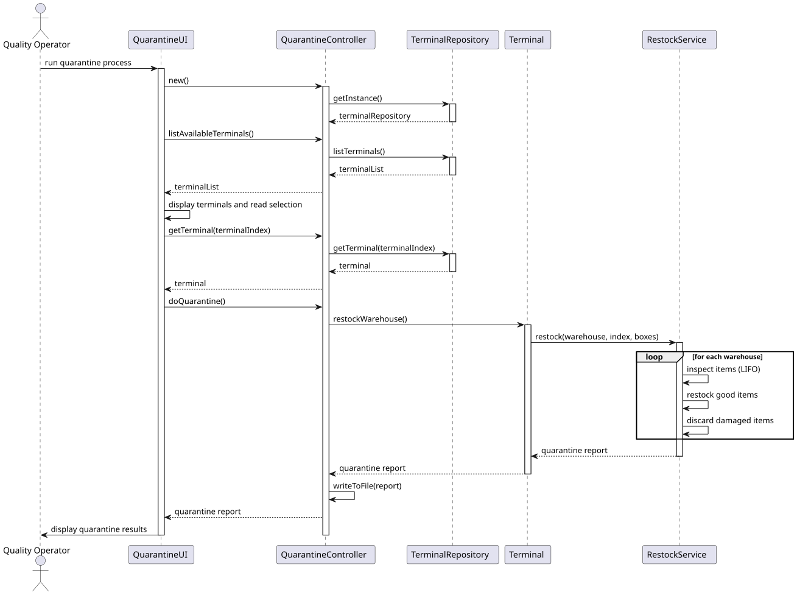
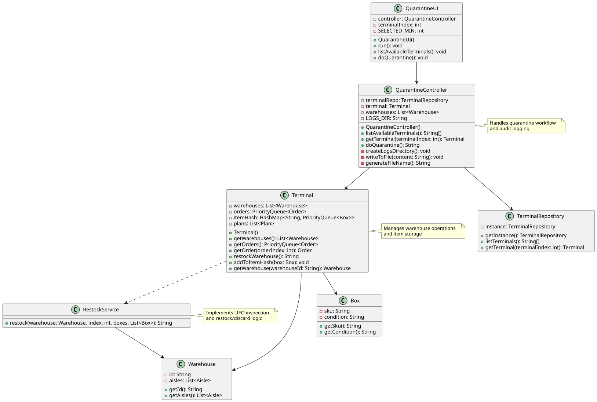

# US005 - As a quality operator, I want to check the .csv file to see which items need to be restocked and which will be thrown away.

## 3. Design

### 3.1. Description

- The system processes returned goods through quarantine inspection
- Items are inspected in LIFO (latest-first) order
- Items in good condition are restocked according to FEFO/FIFO rules
- Damaged or expired items are discarded
- All actions are logged to timestamped audit files

### 3.2. Rationale

**The rationale grounds on the SSD interactions and the identified input/output data.**

| Interaction ID | Question: Which class is responsible for... | Answer | Justification (with patterns) |
|:---|:---|:---|:---|
| Step 1: Listing available terminals | listing all available terminals? | `TerminalRepository` | Information Expert |
| | displaying available terminals? | `QuarantineUI` | Pure Fabrication |
| Step 2: Selecting a terminal | reading user terminal selection? | `QuarantineUI` | Pure Fabrication |
| | retrieving the selected terminal? | `TerminalRepository` | Information Expert |
| Step 3: Executing quarantine process | coordinating the quarantine workflow? | `QuarantineController` | Controller |
| | performing the actual restock/discard operations? | `Terminal` | Information Expert |
| | handling the quarantine logic and inspection? | `RestockService` | Pure Fabrication |
| Step 4: Generating audit logs | writing quarantine results to log files? | `QuarantineController` | Pure Fabrication |
| | displaying quarantine results to user? | `QuarantineUI` | Pure Fabrication |

### Systematization ##

According to the taken rationale, the conceptual classes promoted to software classes are:

* Terminal
* TerminalRepository
* Warehouse

Other software classes (i.e. Pure Fabrication) identified:

* QuarantineUI
* QuarantineController
* RestockService

## 3.3. Sequence Diagram (SD)

## 3.4. Class Diagram (CD)

