# 🚄 Sprint 2 Demo - LAPR3 Project

## 📋 Project Overview
A railway management system featuring route planning and train scheduling capabilities.

---

## 🗺️ Route Planning Menu

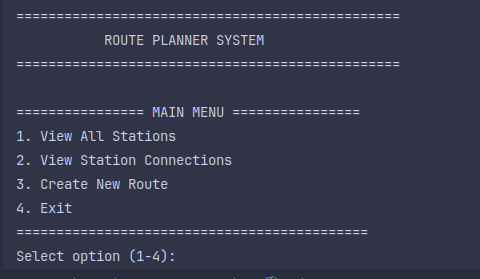

### ✨ Available Features:

#### 1. **View All Stations** 

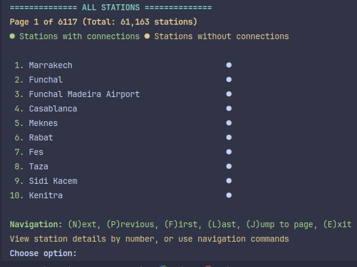
- **Fully paginated interface**
- **Detailed station information available**
- **Interactive station selection**

**📊 Station Details View:**

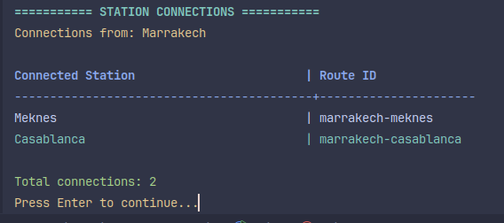

#### 2. **View Connected Stations**

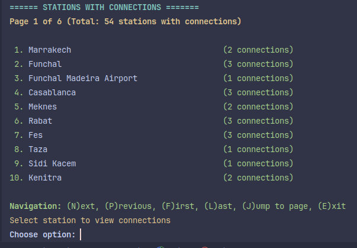
- **Network visualization**
- **Connection mapping**
- **Detailed station insights**

#### 3. **Create New Routes**
**Route Creation Process:**

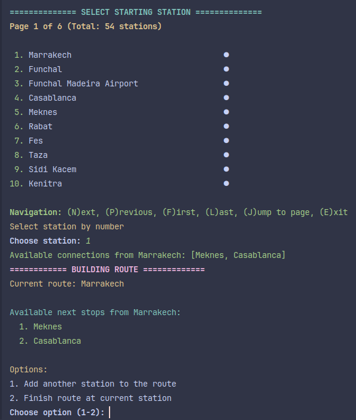

**Route Finalization:**

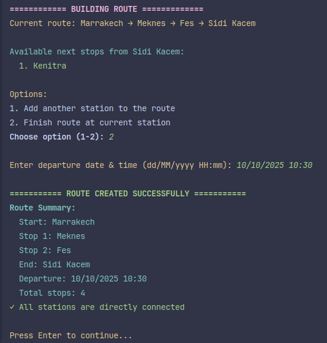

---

## ⏰ Train Scheduling Menu

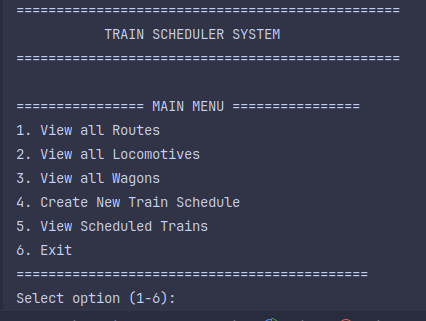

### ✨ Available Features:

#### 1. **View All Created Routes**

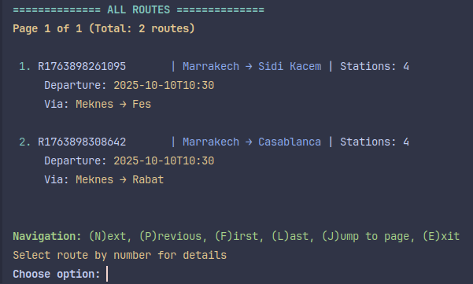
- **Complete route catalog**
- **Pagination support**
- **Detailed route analytics**

**📈 Route Information Display:**

**Unscheduled Route:**

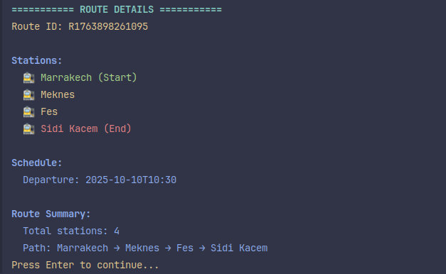

**Scheduled Route:**

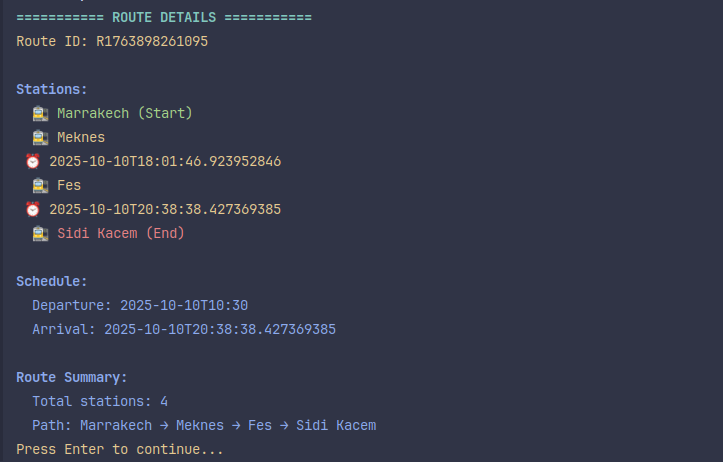

#### 2. **Locomotive Management**

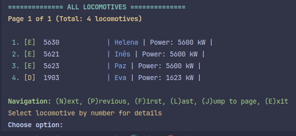
- **Complete fleet overview**
- **Performance metrics**
- **Maintenance status**

**🔧 Locomotive Details:**

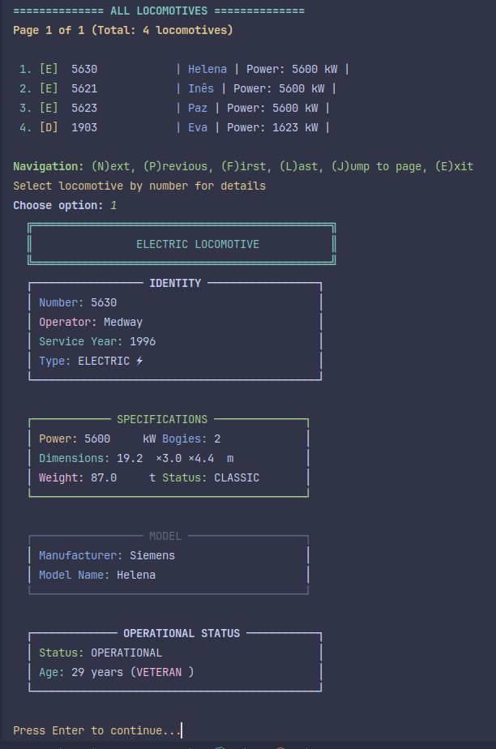

#### 3. **Wagon Inventory**

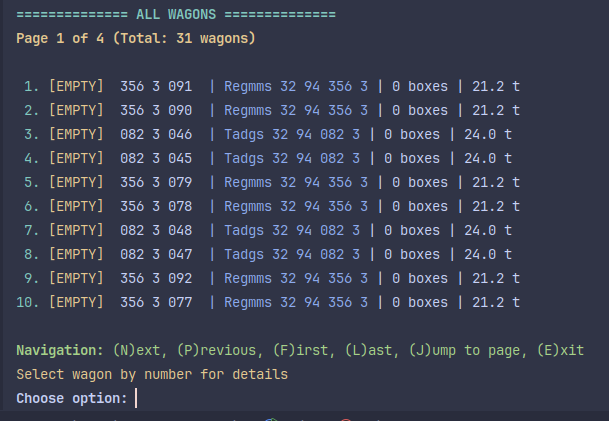
- **Inventory management**
- **Capacity tracking**
- **Status monitoring**

**📦 Wagon Details:**

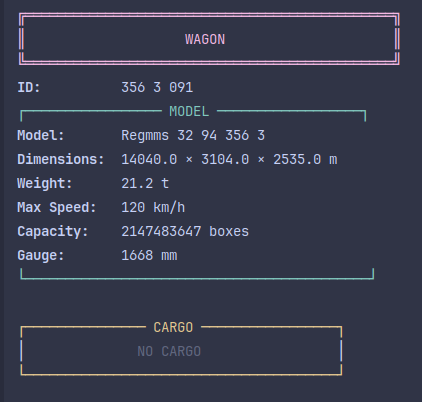

#### 4. **Create New Train Schedule**

**Step-by-Step Scheduling Process:**
| Step | Preview |
|------|---------|
| 1 | 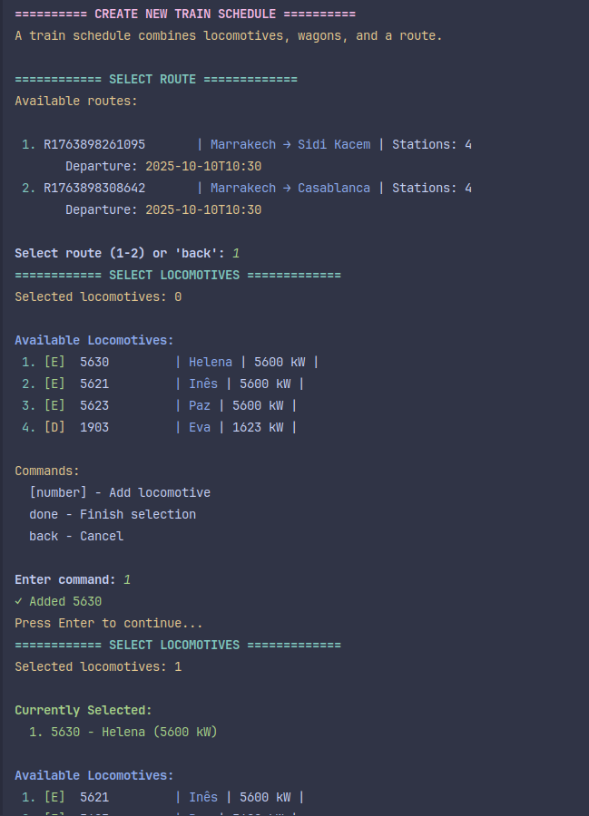 |
| 2 |  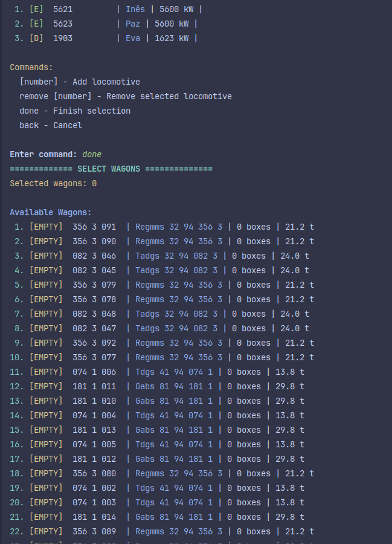 |
| 3 |  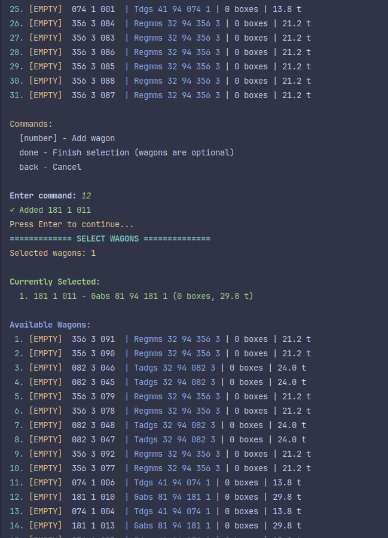 |
| 4 |  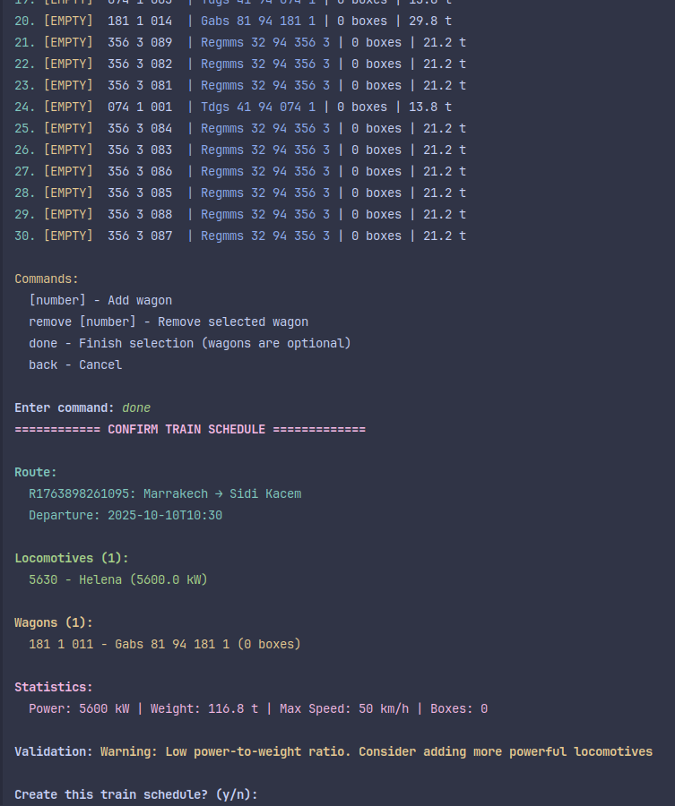 |

### 🎯 System Responses

#### ✅ **Success Scenarios**
**Successful Schedule Creation:**

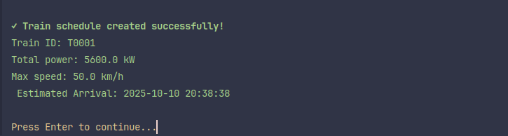

**Valid Train Configuration:**

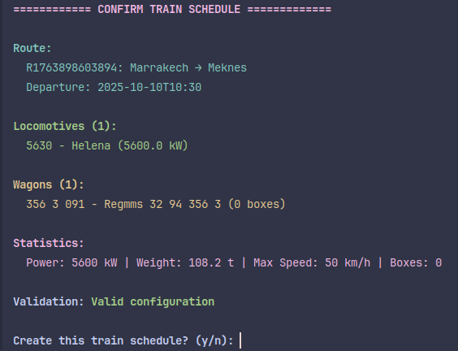

#### ⚠️ **Warning Scenarios**
**Performance Compromises:**

> *Triggered when locomotive performance is compromised by excess wagons*

#### ❌ **Error Scenarios**
**Missing Routes:**

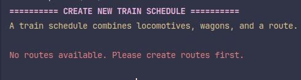
> *Displayed when no routes are available for scheduling*

**Schedule Conflicts:**

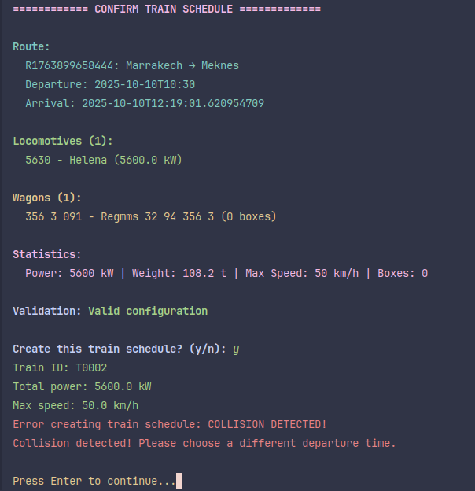
> *Prevents scheduling conflicts and collisions*

*Demo prepared for LAPR3 Project - Sprint 2 Review*
